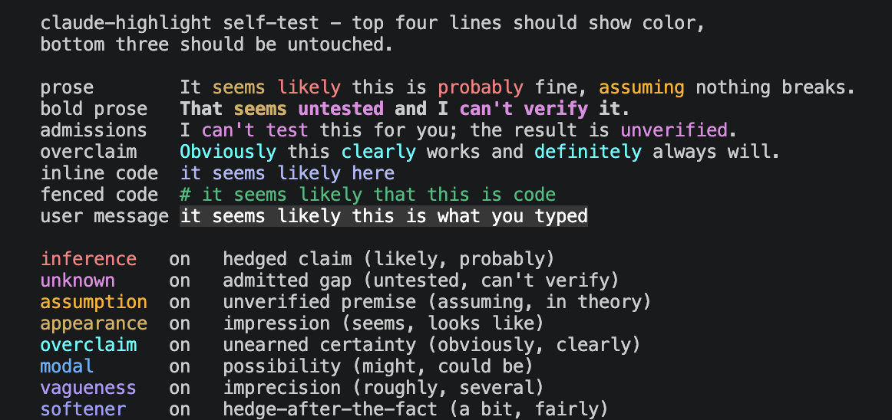

# claude-highlight



Colors the hedges in Claude Code's output, live, as it streams.

Words like *likely*, *seems*, *assuming*, *untested* and *obviously* get a color so you can see at a glance where the model is guessing, admitting a gap, or overclaiming. Nothing else about the session changes.

## Install

    npm install -g claude-highlight
    bun install -g claude-highlight

## Use

    claude-highlight              # instead of: claude
    claude-highlight --resume     # any claude arguments pass straight through

Press **F9** during a session to toggle categories. Changes apply immediately and are saved.

Scripts and hooks still get the real `claude`.

    claude-highlight --hl-selftest   # prints sample text; check that color shows up
    claude-highlight --hl-help       # the wrapper's own flags

## What gets colored

| category | examples | default |
|---|---|---|
| inference | likely, probably | on |
| unknown | untested, can't verify | on |
| assumption | assuming, in theory | on |
| appearance | seems, looks like | on |
| overclaim | obviously, clearly | on |
| modal | might, could be | off |
| vagueness | roughly, several | off |
| softener | a bit, fairly | off |

Only Claude's prose is colored. Your own messages, inline code, and fenced code with a language tag are left alone. A fenced block with no language looks like prose in the byte stream, so hedge words inside one are still colored.

## Config

`~/.config/claude-highlight/config.json` (honors `XDG_CONFIG_HOME`), re-read
whenever it changes. Add words to a category, or define your own:

```json
{
  "categories": {
    "inference": { "add": ["gut feel", "ballpark"] }
  },
  "custom": {
    "deadline": {
      "color": "38;5;99", "on": true, "desc": "schedule risk",
      "terms": ["slipping", "at risk", "behind schedule"]
    }
  }
}
```

Terms are matched literally; prefix with `re:` for a regex. Terms that fail to compile are skipped and listed by `--hl-selftest`.

## How it works

It runs `claude` on a pseudo-terminal and wraps matched words in ANSI color codes on the way to your screen. Color codes are zero-width, so Claude Code's layout is unaffected. A filter keeps matches out of escape sequences and handles words split across stream chunks; a shadow screen removes color that would otherwise linger after Claude redraws a line, and keeps color out of the input box while you type.

## Development

    git clone https://github.com/NoahBPeterson/claude-highlight
    npm run test:all      # every suite, under node
    npm run test:all:bun  # same suites, under bun
    bun run build         # dist/, what the published bin points at

Building needs Bun, but running does not. The pty comes from `node-pty` under Node and from `openpty` via `bun:ffi` under Bun. Everything else is shared.

The repo also contains `src/hedge_scan.ts`, which scores your local Claude Code transcripts with the same lexicon, and `src/hedge_hook.ts`, a Stop hook that flags hedge-heavy turns. Neither is part of the npm package.

## License

MIT
